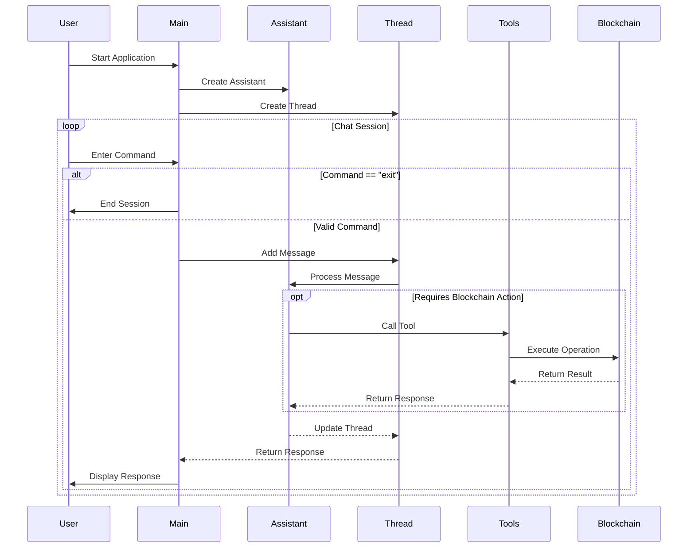

# Xrpgent

## Description

**Xrpgent** is a powerful tool designed to interact with [XRPL network](https://xrpl.org/) following the principles of the [PostWeb by Outlier Ventures](http://postweb.io/). It leverages OpenAI's models to provide a conversational interface for users to perform various blockchain operations, such as checking wallet balances, sending transactions, and more. 

## What is the problem?
Blockchain networks have brought many new opportunities to millions (if not billions) of people, but the problem lies in the interaction, since Web3 has not managed to popularize such opportunities because it is complex to use for non-technical users (managing wallets, signing transactions, many approvals before spending, among others).

AI appears as an opportunity not only to reach non-technical users, but also to reduce the time and steps for each interaction, that is, to do a lot with few instructions.

## Xrpgent was born to solve this problem
There are already many frameworks designed to connect AI agents to Blockchain, but Xrpgent goes one step further, with the following features:
- Lightweight, with few dependencies needed.
- Focused on the XRPL ecosystem (already integrated with some functions and extensible in a few steps).
- Ability to execute several on-chain actions with a single instruction (for example: "send 0.3 XRP to ... and then use create a check for ...").

## Mode
For now, Xrpgent works in a CLI mode, in the future, it will be available to integrate in other platforms, such as messaging.


## Features

- **Conversational Interface**: Engage with the assistant to perform blockchain operations through natural language.
- **Wallet Operations**: Check wallet balances, last transactions, retrieve connected wallet addresses, and more.
- **Transaction Management**: Send transactions (coins and tokens) with customizable parameters.
- **Checks Management**: Manage and send checks
- **Offer Management**: Create and work with offers
- **AMM Management**: Work with Automated Maker Makers natively in the network.
- **Error Handling**: Robust error handling and feedback for failed operations.

## Getting Started

### Prerequisites

- Node.js (version 14 or higher)
- TypeScript
- [OpenAI API key](https://platform.openai.com/) to enable the AI agent.
- A XRPL wallet (secret key)

### Installation

1. Clone the repository:

   ```bash
   git clone https://github.com/nescampos/Xrpgent.git
   cd Xrpgent
   ```

2. Install dependencies:

   ```bash
   bun install
   ```

3. Set up environment variables:
   Create a `.env` file in the root directory and add your OpenAI API key, wallet key file and other information for the network:
   ```plaintext
      ## XRPL PARAMETERS
      # WALLET_SECRETKEY=**************** enter your XRPL secret key here
      # XRPL_SERVER=************** enter the XRPL WS RPC (can be in mainnet, testnet, devnet or any you want)


      ## OPENAI PARAMETERS
      # OPENAI_API_KEY=************ enter your key here
      # OPENAI_ASSISTANT_NAME=************ enter a name for the assistant
      # OPENAI_MODEL=************ enter the model to use (ex: gpt-4o-mini)
   ```

### Usage

To start the assistant, run:

```bash
bun run src/index.ts
```

You can then interact with the assistant in the command line. Type "exit" to end the conversation.

### Tools

The assistant has access to various tools for performing blockchain operations:

#### Read Operations
- Retrieve connected wallet address using **get_wallet_address**
- Retrieve the native balance in XRP for the wallet using **get_balance**
- Retrieve the balances of tokens for the wallet using **get_token_balances**
- Get the checks in a wallet using **get_checks**
- Get the last transactions of a wallet using **get_transactions**
- Get the offers between 2 tokens/coins in a wallet using **get_offers**
- Get the AMMs (Automated Market Makers) using **get_amms**


#### Write Operations
- Send coins and tokens using **send_transaction**
- Create a send a new check using **send_check**
- Cancel a check using **cancel_check**
- Create a new offer between 2 tokens/coins using **create_offer**
- Cancel an offer using **cancel_offer**
- Create an AMM (Automated Market Maker) for 2 tokens/coins using **create_amm**
- Cash a check using **cash_check**

#### How to extend

1. Create the actions in the [src](./src/) folder
2. Create a new tool file in the [tools](./tools/) folder.
3. Add the function in the tool with unique name.
4. Register the tool in [allTools](./tools/allTools.ts)
5. Update the prompt (**in the prompt file inside the constants folder**) for the assistant to understand when it must run the tool.


## Codebase Flow

The following sequence diagram illustrates the core flow of the application:



### Diagram Explanation

The sequence diagram above shows the interaction flow between different components:

1. **Initialization**:
   - Xrpgent starts with creating an OpenAI Assistant
   - A new Thread is created for the conversation

2. **Chat Session Loop**:
   - User enters commands through the CLI
   - Commands are processed through the Thread and Assistant
   - For blockchain operations in XRPL, specific Tools are called
   - Results are returned through the chain of components

3. **Blockchain Integration**:
   - Tools interface with the blockchain through typescript sdks client
   - Operations are executed on the XRPL network
   - Results are propagated back to the user

4. **Session Management**:
   - Users can exit the application at any time
   - Each command is processed in a sequential manner
   - Responses are displayed back to the user


## Team

**Company**: [Techgethr](https://www.techgethr.com/), a Blockchain and Web3 Venture Builder

1. Nestor Campos (developer): https://www.linkedin.com/in/nescampos/


## Contributing

Contributions are welcome! Please open an issue or submit a pull request for any enhancements or bug fixes.

## License

This project is licensed under the MIT License. See the [LICENSE](LICENSE) file for details.